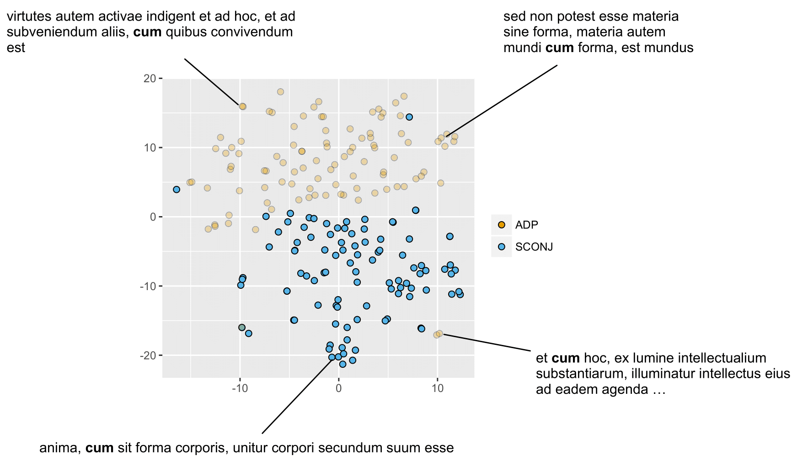

# latin-bert

Latin BERT is a contextual language model for the Latin language, described in more detail in the following:

David Bamman and Patrick J. Burns (2020), [Latin BERT: A Contextual Language Model for Classical Philology](https://arxiv.org/abs/2009.10053), ArXiv.

### Install

1.) Create a [conda environment](https://www.anaconda.com/download/) (optional):

```sh
conda create --name latinbert python=3
conda activate latinbert
```

2.) Install PyTorch according to your own system requirements (GPU vs. CPU, CUDA version): [https://pytorch.org](https://pytorch.org).


3.) Install the remaining libraries:


```sh
pip install -r requirements.txt
```

4.) Install Latin tokenizer models:

```sh
python3 -c "from cltk.corpus.utils.importer import CorpusImporter; corpus_importer = CorpusImporter('latin');corpus_importer.import_corpus('latin_models_cltk')"
```

5.) Download pre-trained BERT model for Latin:

```sh
./scripts/download.sh
```

### Minimal example

For a minimal example of how to generate BERT representations for an input sentence, execute the following:

```sh
python3 scripts/gen_berts.py --bertPath models/latin_bert/ --tokenizerPath models/subword_tokenizer_latin/latin.subword.encoder > berts.output.txt
```

This generates BERT representations for two sentences and saves their output with one (token, 768-dimensional final BERT representation) tuple per line.  For examples of how to fine-tune Latin BERT for a specific task, see the case studies on POS tagging and WSD.

### Data

Latin BERT is pre-trained using data from the following sources.


|Source|Tokens|
|---|---:|
|[Corpus Thomisticum](https://www.corpusthomisticum.org/iopera.html)|14.1M|
|[Internet Archive](https://archive.org)|561.1M|
|[Latin Library](https://www.thelatinlibrary.com)|15.8M|
|[Patrologia Latina](https://github.com/OpenGreekAndLatin/patrologia_latina-dev)|29.3M|
|[Perseus](http://www.perseus.tufts.edu)|6.5M|
|[Latin Wikipedia](https://la.wikipedia.org)|15.8M|
|Total|642.7M|

Texts from Perseus and the Latin Library are drawn from the corpora in the [Classical Language Toolkit](http://cltk.org).  Texts are tokenized for sentences and words using Latin-specific tokenizers in CLTK.  We learn a Latin-specific WordPiece tokenizer using [tensor2tensor](https://github.com/tensorflow/tensor2tensor/blob/master/tensor2tensor/data_generators/text_encoder_build_subword.py) from this training data.


Since the texts from the Internet Archive (IA) are the product of noisy OCR, we uniformly upsample all non-IA texts to train on a balance of approximately 50% IA texts and 50% non-IA texts.

### Training

We pre-train Latin BERT using [tensorflow](https://github.com/google-research/bert) on a TPU for 1M steps. Training took approximately 5 days on a TPU v2, and cost ~$540 on Google Cloud (at $4.50 per TPU v2 hour).  We set the maximum sequence length to 256 WordPiece tokens.

We convert the resulting tensorflow checkpoint into a BERT model that can used by the HuggingFace library using the [transformers-cli](https://github.com/huggingface/transformers/blob/master/transformers-cli) library.  The model in `model/latin_bert` can be used with the HuggingFace transformers library.


## Case studies

Bamman and Burns (2020) illustrates the affordances of Latin BERT with four case studies; here is a quick summary of them.

### 1. POS Tagging

Latin BERT demonstrates meaningful part-of-speech distinctions in its representations without further task-specific training.



When trained on POS tagging, Latin BERT achieves a new state of the art on all three Universal Dependency datasets for Latin.

Method|Perseus|PROIEL|ITTB|
|---|---|---|---|
Latin BERT|**94.3**|**98.2**|**98.8**|
Straka et al. (2019)|90.0|97.2|98.4|
Smith et al. (2018)|88.7|96.2|98.3|
Straka (2018)|87.6|96.8|98.3|
Static embeddings|87.6|95.2|97.6|
Boros et al. (2018)|85.7|94.6|97.7|

### 2. Text infilling

Latin BERT can be used to generate probabilites for lacunae and other missing words in context.  For example, consider the following sentence:

> dvces et reges carthaginiensivm hanno et mago qui ___ punico bello cornelium consulem aput liparas ceperunt

The words with the highest probabilities predicted to fill that slot are the following:

|Word|Probability|
|---|---|
|secundo|0.451|
|primo|0.385|
|tertio|0.093|
|altero|0.018|
|primi|0.012|
|priore|0.012|
|quarto|0.005|
|secundi|0.004|
|primum|0.002|
|superiore|0.002|

(Note "primo" here is a textual critic's emendation.)  Latin BERT is able to reconstruct an exact human-judged ementation 33.1% of the time; in 62.2% of cases, the human emendation is in the top 10 predictions.

### 3. Word sense disambiguation

Latin BERT is able to distinguish between senses of Latin words. We construct a new WSD dataset by mining citations from the Lewis and Short *Latin Dictionary*, and measure the ability of different methods to distinguish between them given the context of the sentence. In a balanced evaluation (where random choice yields 50% accuracy), Latin BERT outperforms static embeddings by over 8 absolute points.

|Method|Accuracy|
|---|---|
|Latin BERT|75.4|
|Static embeddings|67.3|
|Random|50.0|

### 4. Contextual nearest neighbors

BERT representations are contextual embeddings, so the same word type (e.g., *in*) will have a different representation in each sentence in which it is used.  While static embeddings like word2vec allow us to find words that are most similar to a given word *type*, BERT (and other contextual embeddings) allow us to find other words that are most similar to a given word *token*. For example, we can find tokens in context that are most similar to the representation for *in* within *gallia est omnis divisa <span style="color:#FF00FF">in</span> partes tres*:

|Cosine|text|citation|
|---|---|---|
|0.835|ager romanus primum divisus <span style="color:#FF00FF">in</span> partis tris, a quo tribus appellata titiensium ...|Varro, *Ling*. |
|0.834|in ea regna duodeviginti dividuntur <span style="color:#FF00FF">in</span> duas partes.|Sol. |
|0.833|gallia est omnis divisa <span style="color:#FF00FF">in</span> partes tres, quarum unam incolunt belgae, aliam ...|Caes., *BGall*.|
|0.824|is pagus appellabatur tigurinus; nam omnis civitas helvetia <span style="color:#FF00FF">in</span> quattuor pagos divisa est.|Caes., *BGall*. |
|0.820|ea pars, quam africam appellavimus, dividitur <span style="color:#FF00FF">in</span> duas provincias, veterem et novam, discretas fossa ...|Plin., *HN* |
|0.817|eam distinxit <span style="color:#FF00FF">in</span> partes quatuor.|Erasmus, *Ep.* |
|0.812|hereditas plerumque dividitur <span style="color:#FF00FF">in</span> duodecim uncias, quae assis appellatione continentur.|Justinian, *Inst.*|


The most similar tokens not only capture the specific morphological constraints of this sense of *in* appearing with a noun in the accusative case (denoting *into* rather than *within*) but also broadly capture the more specific subsense of division *into* parts.
